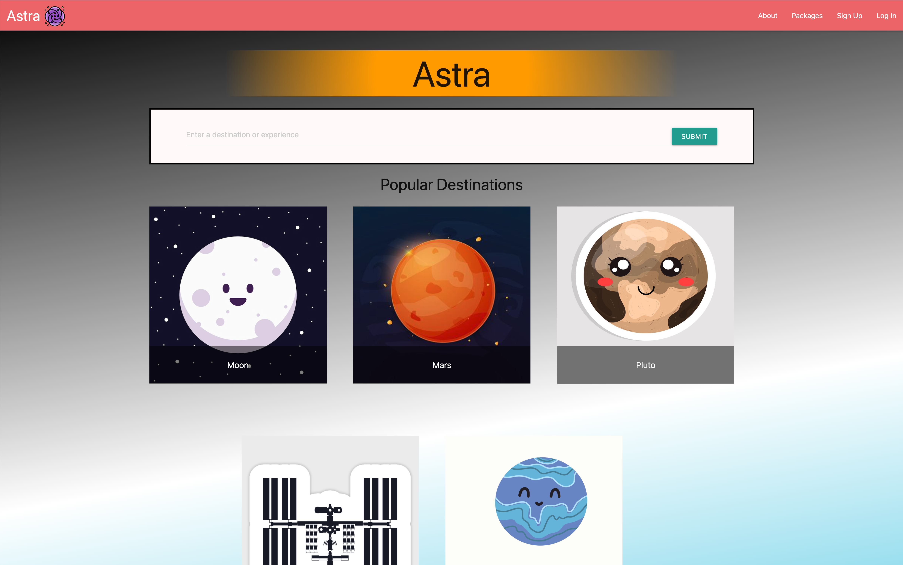
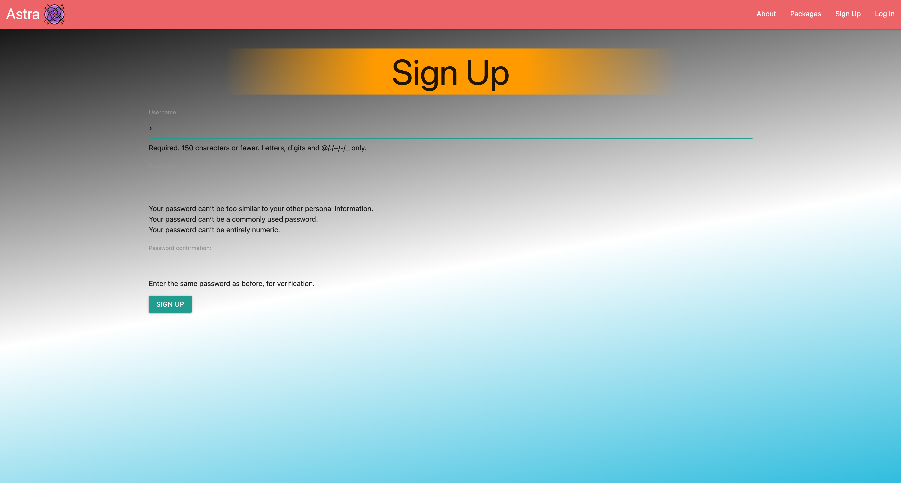
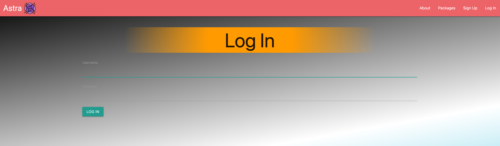

  

  # ASTRA

  ### [CLICK TO DEMO]()

  ##### Vincent Kubota, Yeshi, Chris Sakae

  ## :pencil: Description

  ASTRA is a marketplace for affordable and exciting space travel! Here you can find and plan a unique trip to various destinations and enjoy a multitude of experiences in space. If you want Pluto... WE GOT IT!!!

  

## :camera_flash: Screenshots

   <h3 align="center">Home Page</h3>  Sign Up</h3>  Login</h3>  Package List</h3>  Order History</h3>  Reviews</h3>  Review Details</h3>  
  
 Sign Up 

    1. Click on the "Sign Up/Login" Link in the navigation bar.
    2. Sign in with your username and password.

  
 View Packages 

    1. Search a destination or experience or click on an experience or destination.
    2. Choose a departure date.
    3. Choose available package.
    4. Select amount of tickets.
    5. Click purchase tickets.

  
 Trello Board 

  <a href="https://trello.com/b/3dJKiPgs/project-astra"
    > https://trello.com/b/3dJKiPgs/project-astra </a
  >

  
 Deployed Link (Heroku) 

  <a href="https://astra-100-1741e87c1ee3.herokuapp.com/"
    > https://astra-100-1741e87c1ee3.herokuapp.com/ </a
  >

## :satellite: Upcoming Features

- [::] NASA API for images and videos.

- [::] Stripe API for payment.

- [::] Discount for multi ticket purchase.

- [::] HTMX implementation.

- [::] More CSS polish for app.